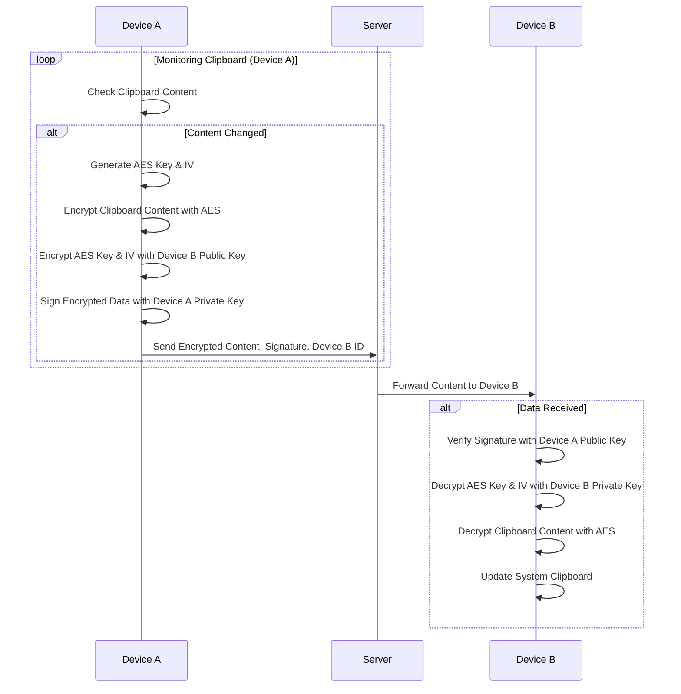
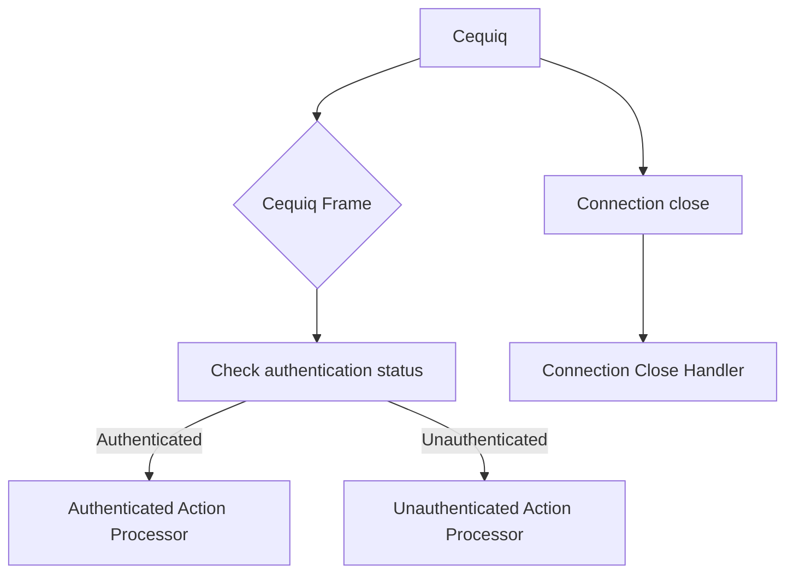
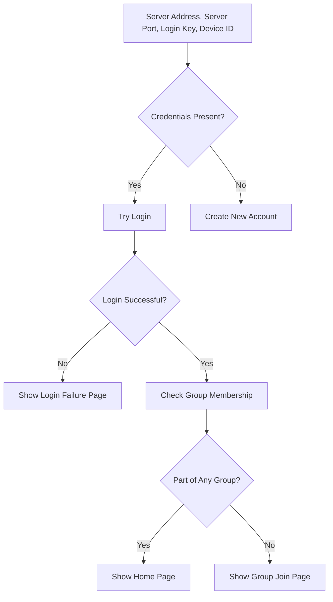
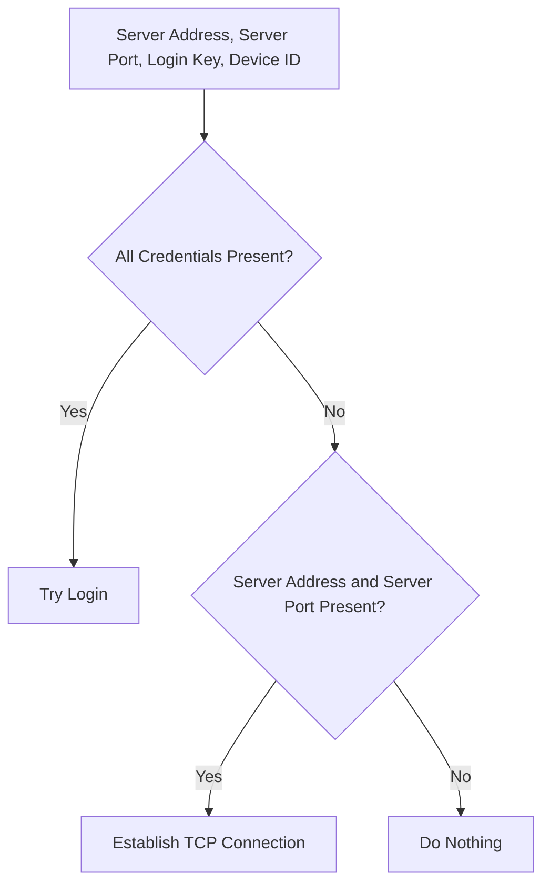

# CTSYNC Server

The server is implemented in C and uses the `epoll` to manage
multiple TLS/TCP connections efficiently in a non-blocking manner.

After establishing a secure TLS session over a TCP socket, the server enters
a continuous loop where it monitors for incoming connections and data. As data
arrives, it is incrementally read and stored in a buffer until a data frame is
formed. Once a frame is completed, a callback function is invoked with the frame
data, after which the application processes the received content.


## Clipboard Text Transfer Process



# Backend overview
Here is an rough overview of the backend:




### Keeping Track of Connections

The `CTSyncState` struct keeps track of two HashMap head pointers, these two HashMaps are used to maintain connection state information of every connection.

```c
typedef struct{
  ConnInfo **conn_info;
  DevToConn **dev_to_conn_id;
  uint32_t res_id;
} CTSyncState;
```

`ConnInfo` struct is used to keep track of every connection *server access status* and *connection authnetication status*.

```c
typedef struct {
  char *conn_id; 
  char *dev_id;  
                 
  access_t svr_access;
  auth_status_t  auth;
  UT_hash_handle hh;
} ConnInfo;
```

`DevtoConn` struct only purpose is to create a way to get connection id when you have device id available.

```c
typedef struct {
  char *dev_id;
  char *conn_id;
  UT_hash_handle hh;
} DevToConn;
```

# Front End


### Server Reconnect

When the application starts, the client establishes a persistent TCP connection with the server.
This connection is maintained in a dedicated Tokio task (a separate thread-like unit). If the connection closes, the task emits a Tauri event to the front end before it exits, signaling that the connection was lost.

On receiving this event, the front end:

- Notifies the user (e.g., a prompt saying "Connection closed").
- Starts pinging the backend to attempt a reconnect.


### Resquest Response Monitor
On every request the `current time`, `request id` and a `callback function`
will be stored in a Hashmap.

Upon receiving a response the `request id` will be cecked in the HashMap and
correspoind callback function with the response data will be called.


### Page to Show on App Start


### Server Reconnect

